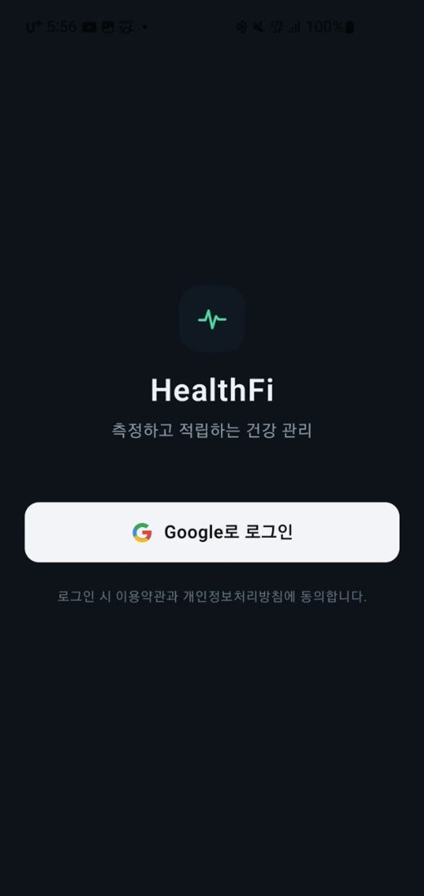
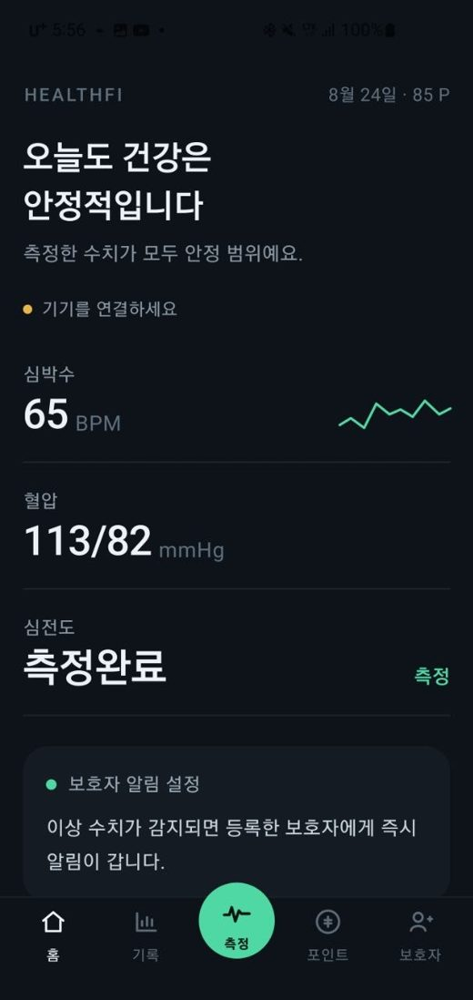
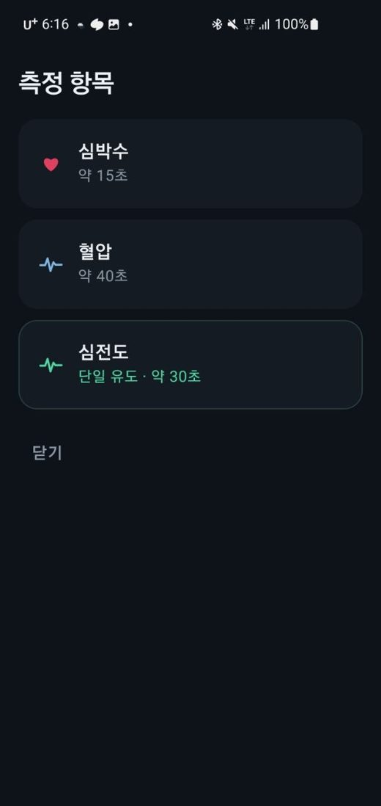
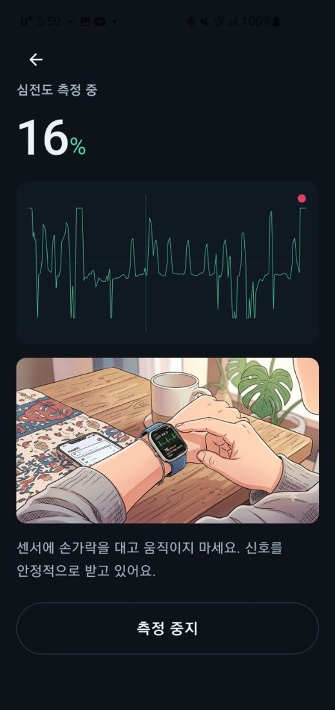
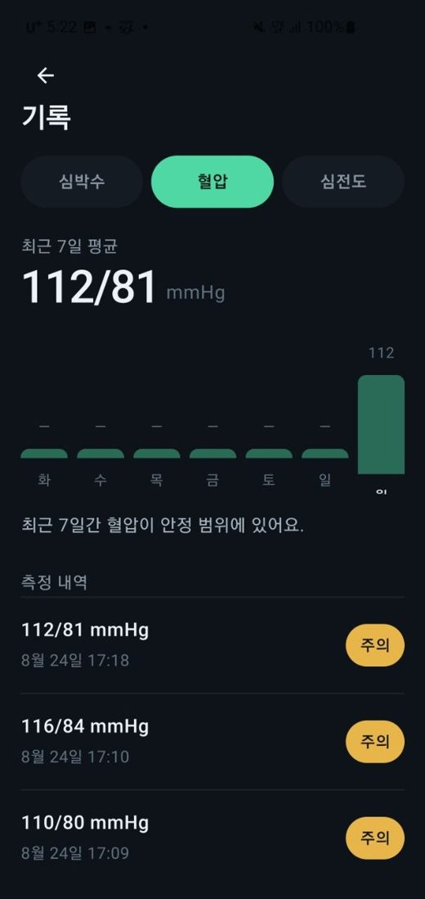
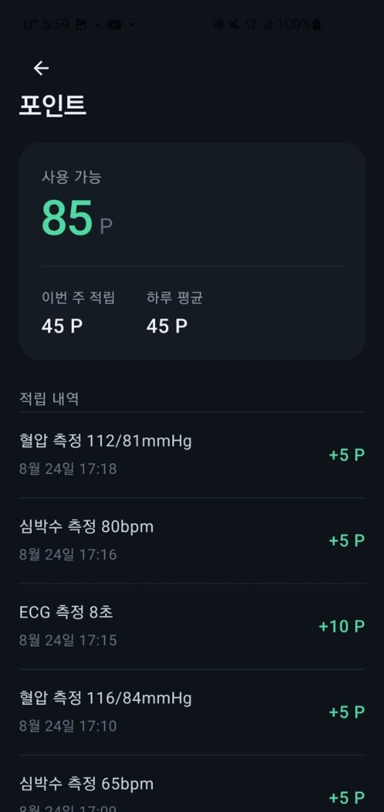

# HealthFi — 측정하고 적립하는 건강 관리

**SL Labs / (주)디지레이**
상태: ● iOS · Android 정식 출시

| 항목 | 내용 |
|---|---|
| 제품명 | HealthFi |
| 한 줄 소개 | 측정하고 적립하는 건강 관리 |
| 플랫폼 | iOS, Android |
| Google Play | https://play.google.com/store/apps/details?id=com.healthfi.app&hl=en |
| App Store | https://apps.apple.com/pl/app/healthfi/id6794863744 |

---

## 개요

HealthFi는 일상적인 건강 관리를 리워드로 바꾸는 앱입니다. 스마트워치로 심박수·혈압·심전도(ECG)를 측정·기록하고, 꾸준히 측정할수록 포인트가 쌓입니다. 이상 수치가 감지되면 가족(보호자)에게 자동으로 경고 알림을 보내, 혼자 건강을 관리하지 않아도 됩니다.

---

## 핵심 기능

### 📈 스마트워치 건강 측정
심박수·혈압·심전도(ECG)를 페어링된 웨어러블로 측정하고, 결과는 자동으로 기록됩니다.

### 🎁 적립형 리워드 (Health-to-Earn)
측정할 때마다 포인트를 적립하고, 일일·주간 보상으로 건강 습관을 이어갑니다.

### 🔔 보호자 경고 알림
이상 수치가 감지되면 텔레그램·SMS·카카오 알림톡으로 가족(보호자)에게 자동으로 알림을 보냅니다.

### 🗂️ 기록 · 추이 관리
모든 측정값을 날짜별로 기록해, 사용자와 가족이 건강 변화를 한눈에 확인합니다.

---

## 앱 화면

| | | |
|---|---|---|
|  |  |  |
|  |  |  |

---

## 기술 스택

- Android · Kotlin / Jetpack Compose
- iOS · Swift / SwiftUI
- Node.js · PostgreSQL
- 웨어러블 BLE SDK
- 온디바이스 ECG 분석
