# SL Labs — 제품 기록 / Product Log

**만들고, 내보낸 것들 — Three products, built and live.**

SL Labs가 기획부터 개발·운영까지 맡고 있는 서비스 세 가지입니다. 메신저 안의 게임, 글로벌 앰버서더 허브, 금융 앱 속 건강 학습 게임 — 각기 다른 플랫폼에서 사용자를 만나고 있습니다.

> Three services SL Labs designs, builds, and runs — one inside a messenger, one on the open web, one inside a banking app.

| | |
|---|---|
| Products | 3 |
| Platforms | LINE · Web · Toss |
| Languages | 5 |
| Chain | opBNB |

**목차**

1. [LuckyDice (럭키다이스)](#ch-01--luckydice-럭키다이스)
2. [Thor Ambassador Hub (토르 앰버서더 허브)](#ch-02--thor-ambassador-hub-토르-앰버서더-허브)
3. [Health Hero (헬스히어로)](#ch-03--health-hero-헬스히어로)

---

## CH 01 · LuckyDice 럭키다이스

**LINE 미니 Dapp · Web3** — [luckydice.savethelife.io](https://luckydice.savethelife.io)

주사위를 굴려 보드를 돌고, 출석·미션·랭킹으로 보상을 쌓는 캐주얼 Web3 게임입니다. LINE 메신저 안에서 설치 없이 바로 실행됩니다.

> A casual Web3 game where you roll dice around a board and stack rewards through check-ins, missions, and rankings — running inside LINE with nothing to install.

### 화면

| 게임 보드 | 미션 & 출석 | 회차 랭킹 보상 | 룰렛 이벤트 |
|---|---|---|---|
| 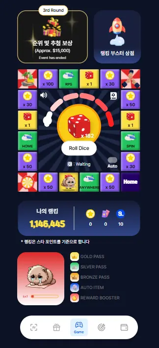 | 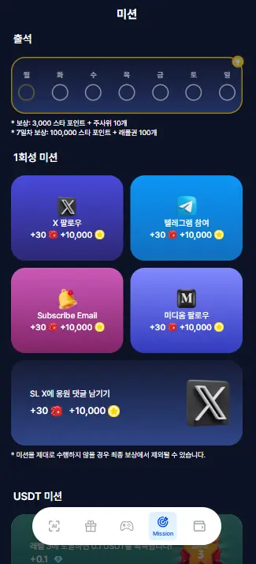 | 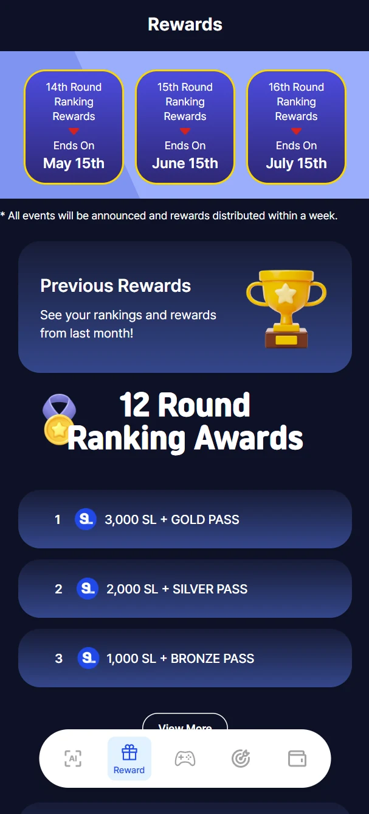 | 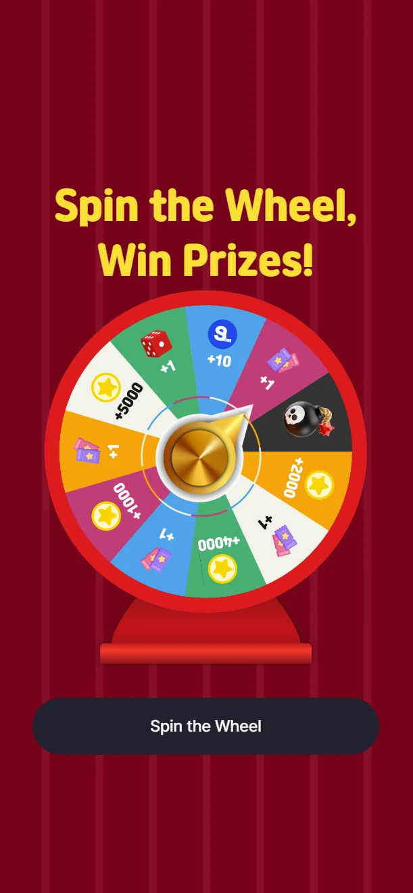 |

| Star Jackpot | 승리 · 배수 도전 | 아이템 & NFT | 자산 & 클레임 |
|---|---|---|---|
| 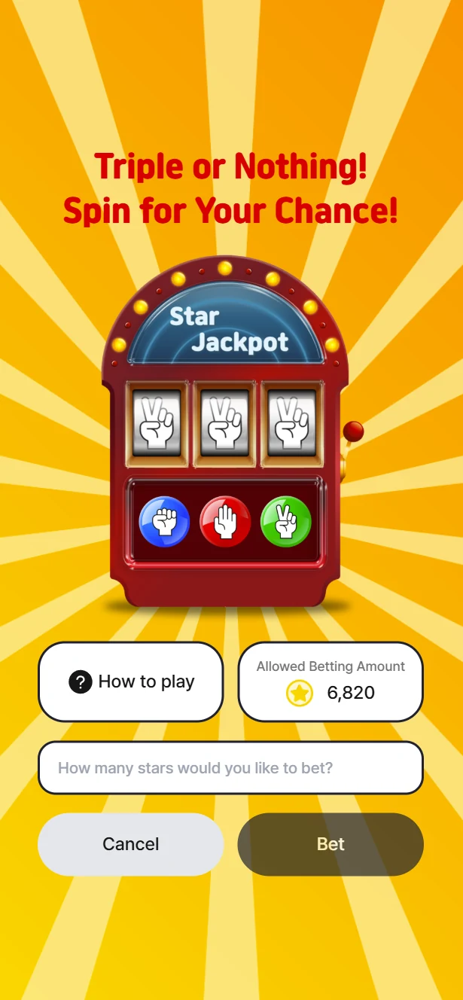 | 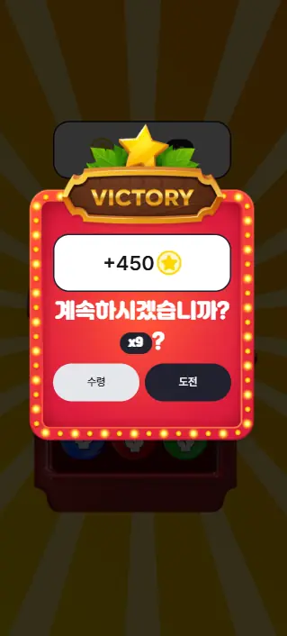 | 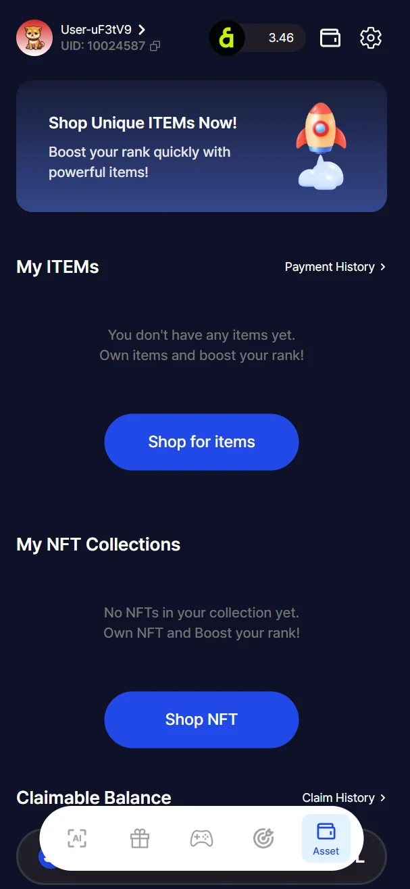 | 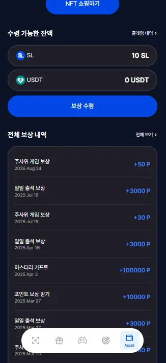 |

### 기능

| 기능 | 설명 |
|---|---|
| 보드 주사위 게임 | 타일마다 포인트·아이템·미니게임이 걸린 보드를 주사위로 이동합니다. 자동 플레이를 지원합니다. |
| 미니게임 | 룰렛과 Star Jackpot 슬롯. 슬롯은 승리 후 배수 도전과 수령 중에 고를 수 있습니다. |
| 출석 & 미션 | 주간 출석과 7일차 대형 보상, X·텔레그램·미디엄 등 1회성 소셜 미션, USDT 미션을 운영합니다. |
| 회차 랭킹 보상 | 스타 포인트로 순위를 매기고, 상위권에 SL 토큰과 등급 패스를 지급합니다. |
| 아이템 & NFT | 랭킹 부스터 아이템과 NFT 컬렉션을 상점에서 구매하고 보유합니다. |
| 지갑 & 클레임 | SL·USDT 잔액을 확인하고 보상을 수령하며, 전체 적립 내역을 남깁니다. |

### 기술 스택

`React` · `TypeScript` · `Vite` · `LINE LIFF` · `Dapp Portal SDK`

---

## CH 02 · Thor Ambassador Hub 토르 앰버서더 허브

**Web · 모바일 최적화** — [thor.savethelife.io](https://thor.savethelife.io)

SL Labs 글로벌 앰버서더가 활동하고 보상받는 허브입니다. 미션과 추천으로 크레딧을 쌓고, 랭킹과 지갑까지 한 곳에서 관리합니다.

> The hub where SL Labs ambassadors earn and track rewards — missions, referrals, rankings, and wallet all in one place.

### 화면

| 홈 · 크레딧 현황 | 미션 & 이벤트 | 랭킹 & 티어 보상 |
|---|---|---|
| 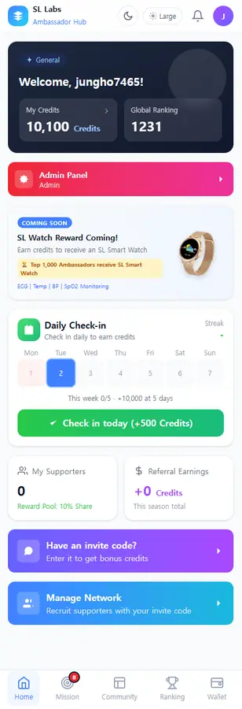 | 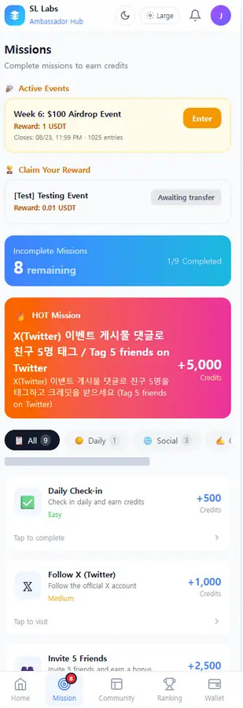 | 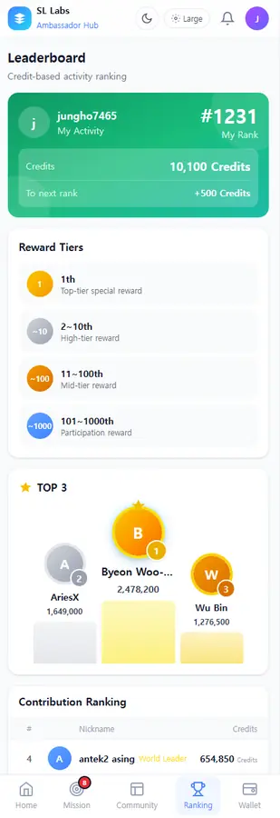 |

| 지갑 & 적립 내역 | 로드맵 | 설정 · 다국어 |
|---|---|---|
| 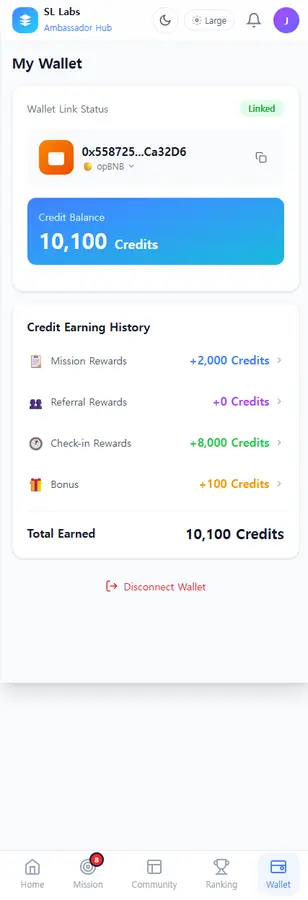 | 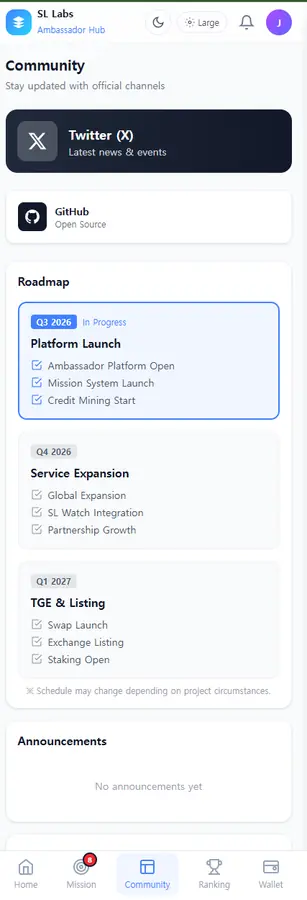 | 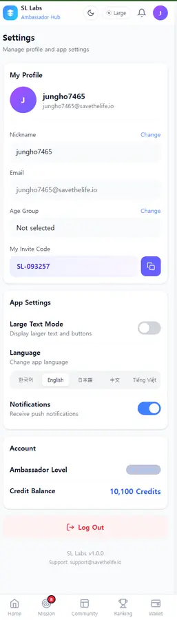 |

### 기능

| 기능 | 설명 |
|---|---|
| 데일리 체크인 | 매일 출석해 크레딧을 적립하고, 주 5일을 채우면 보너스를 받습니다. |
| 미션 & 이벤트 | 난이도별 미션과 마감 기한이 있는 에어드랍 이벤트를 운영하고, 보상 수령까지 처리합니다. |
| 추천 네트워크 | 개인 초대코드로 서포터를 모으고 리워드 풀 지분을 확보합니다. |
| 랭킹 & 티어 | 크레딧 기반 실시간 순위와 구간별 보상, World Leader·Elite 등급 배지를 제공합니다. |
| 지갑 연동 | opBNB 지갑을 연결하고 적립 경로별 크레딧 내역을 확인합니다. |
| 커뮤니티 | 로드맵과 공지, 카테고리별 FAQ, 공식 채널을 한 화면에 모았습니다. |
| 다국어 & 접근성 | 한국어·영어·일본어·중국어·베트남어 5개 언어와 큰 글씨 모드, 다크 모드를 지원합니다. |

### 기술 스택

`Next.js` · `React` · `TypeScript` · `Supabase` · `wagmi + viem` · `opBNB`

---

## CH 03 · Health Hero 헬스히어로

**토스 미니앱 · Apps in Toss** — 토스 앱에서 '헬스히어로' 검색

응급처치와 건강 상식을 퀴즈로 익히는 학습 게임입니다. 토스 앱 안에서 바로 실행되고, 맞히든 틀리든 해설이 남습니다.

> A quiz game for first aid and everyday health knowledge, playable inside Toss — and every answer comes with an explanation.

### 화면

| 인트로 | 메인 맵 | 스테이지 선택 | 퀴즈 |
|---|---|---|---|
| 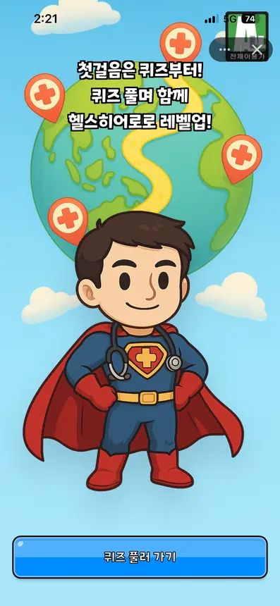 | 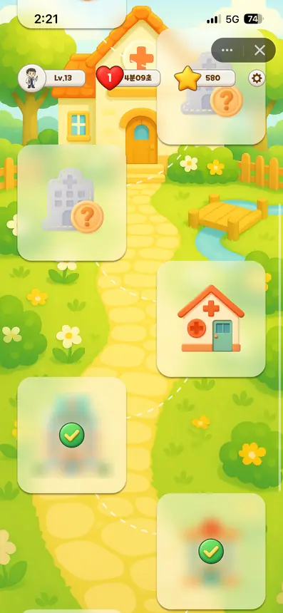 | 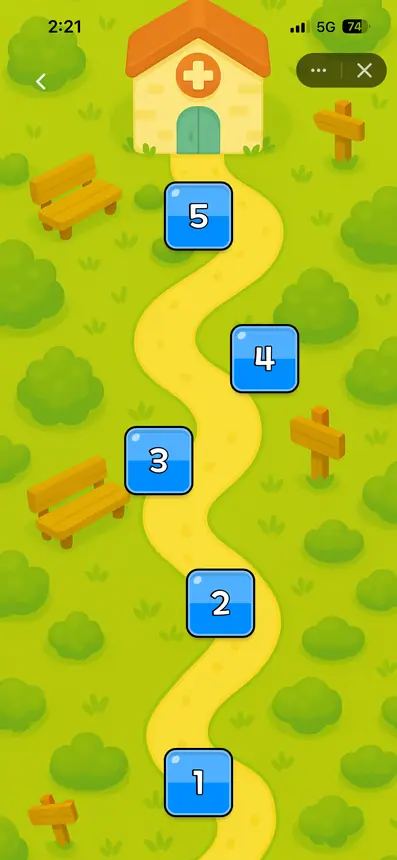 | 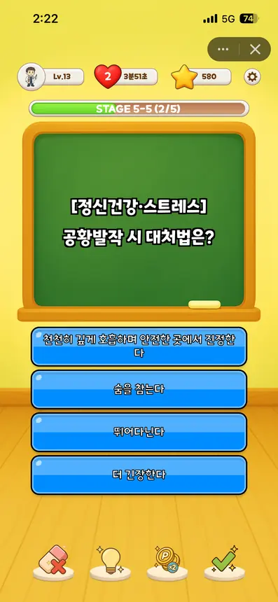 |

| 정답 해설 | 오답 해설 | 클리어 보상 |
|---|---|---|
| 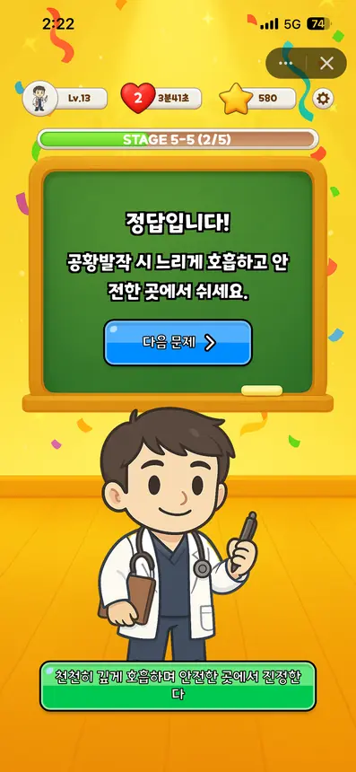 | 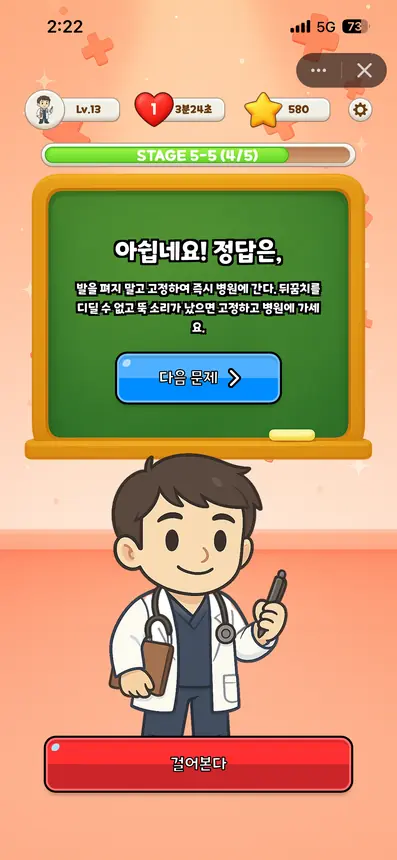 | 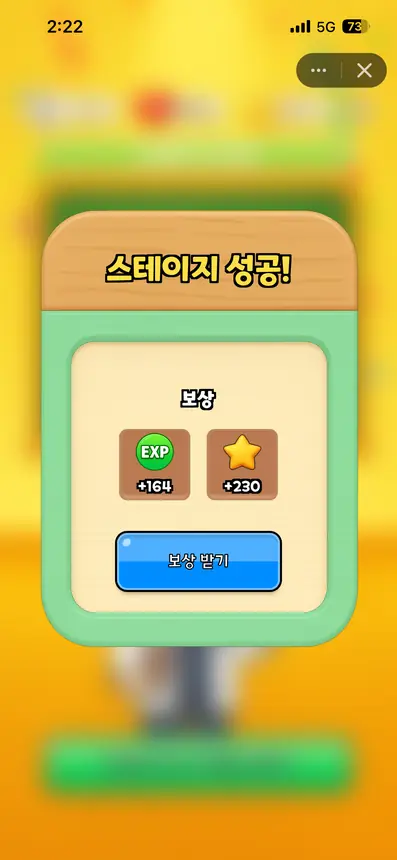 |

### 기능

| 기능 | 설명 |
|---|---|
| 스테이지 진행 | 맵을 따라 스테이지를 해금하며 나아가고, 클리어하면 EXP와 스타를 받습니다. |
| 카테고리 문항 | 정신건강·스트레스, 상처·지혈·골절처럼 실제 상황을 다루는 4지선다로 출제합니다. |
| 해설 학습 | 정답이든 오답이든 곧바로 해설을 보여 주어 문제 하나가 지식 하나로 남습니다. |
| 라이프 & 아이템 | 하트를 소모하고 시간이 지나면 충전됩니다. 오답 소거·힌트·보상 2배·정답 공개 아이템을 씁니다. |
| 레벨 & 성장 | EXP를 모아 레벨을 올리고 스타 포인트를 쌓습니다. |

### 기술 스택

`Phaser 3` · `TypeScript` · `Apps in Toss`

---

**SL Labs · Save the Life**
savethelife.io · support@savethelife.io
