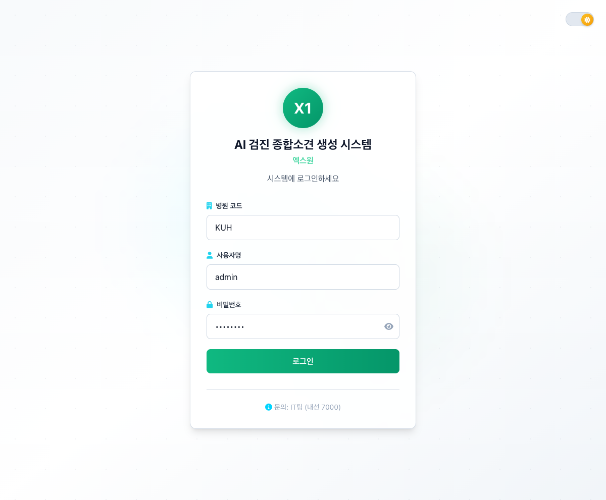
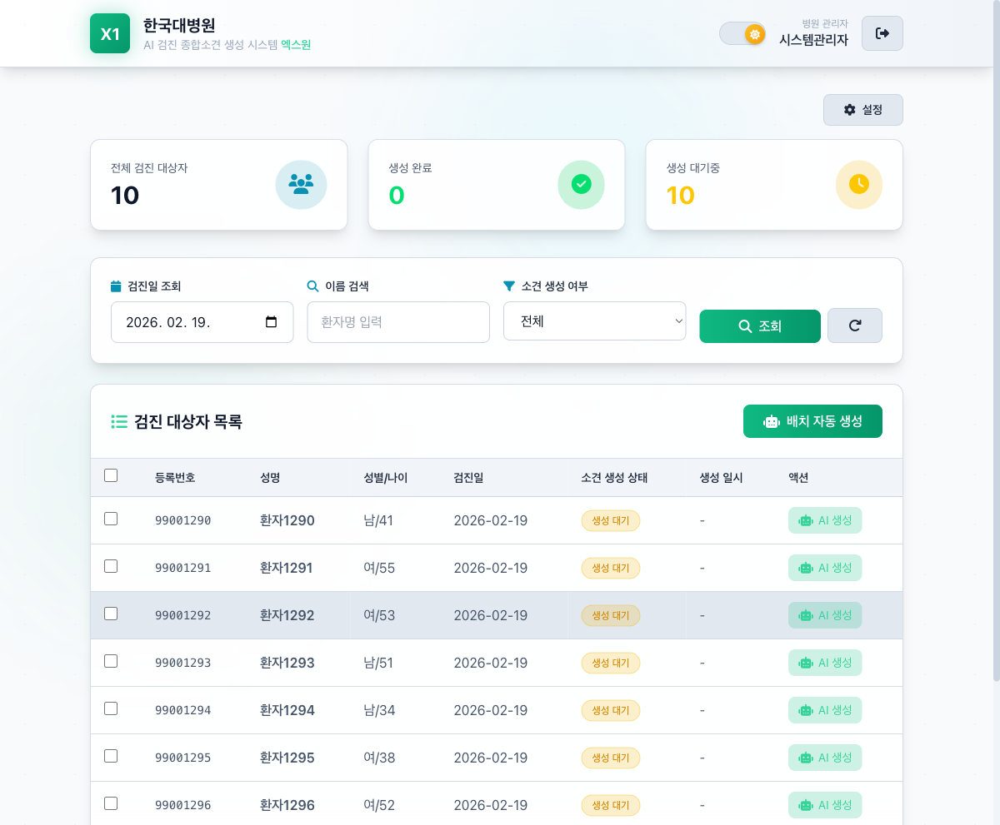
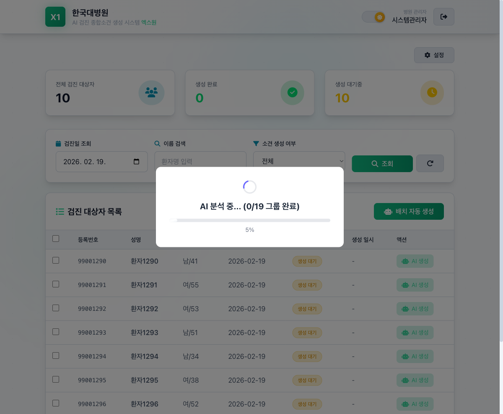
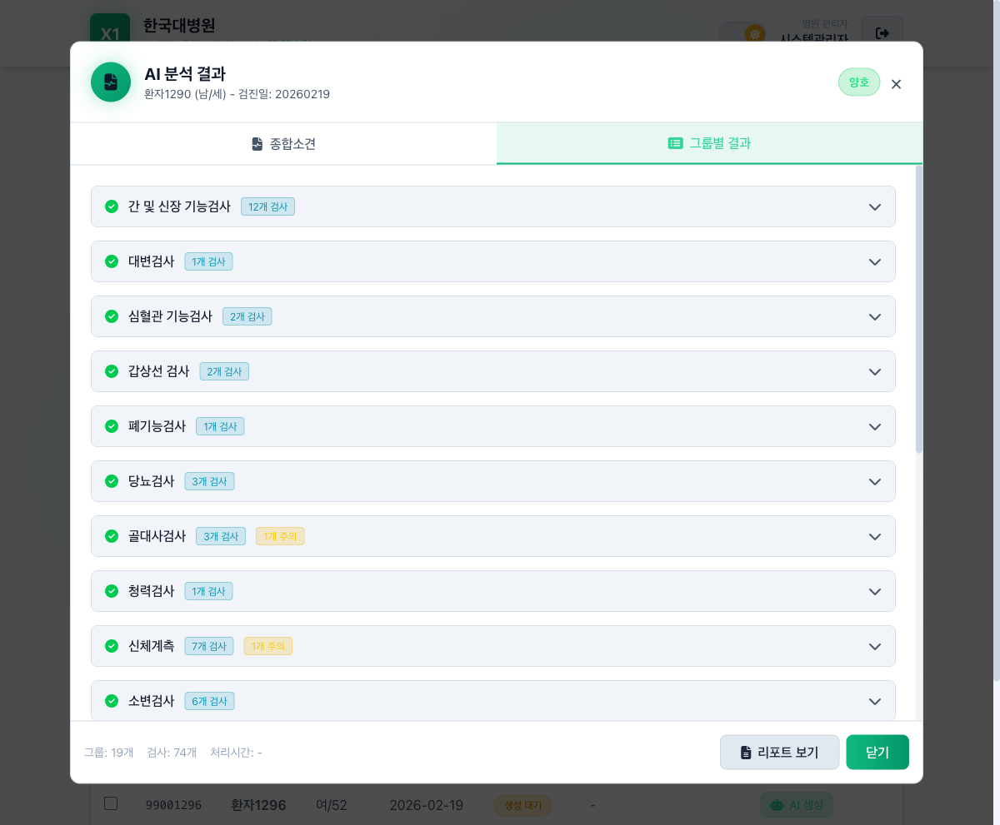
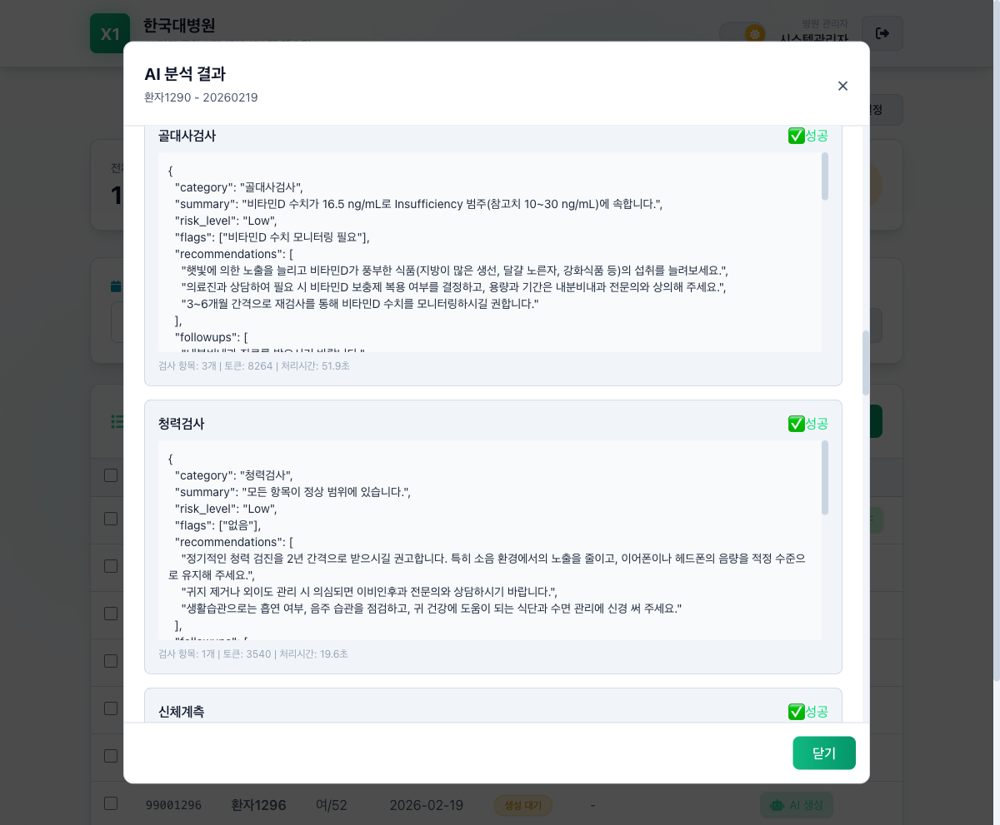
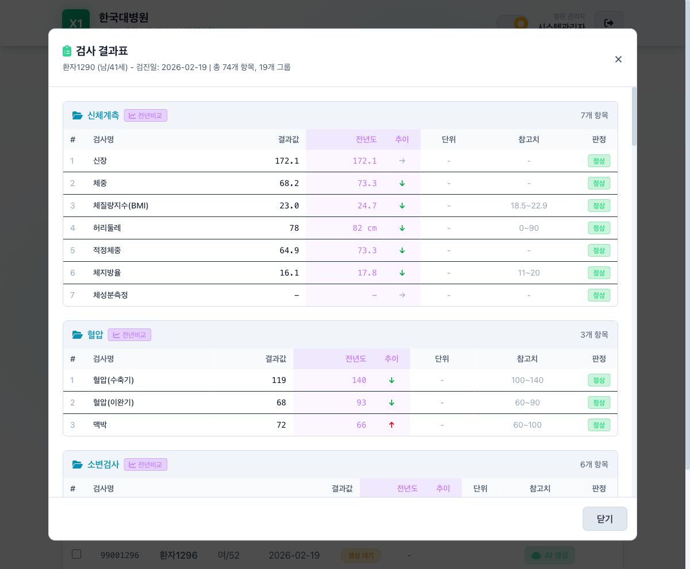
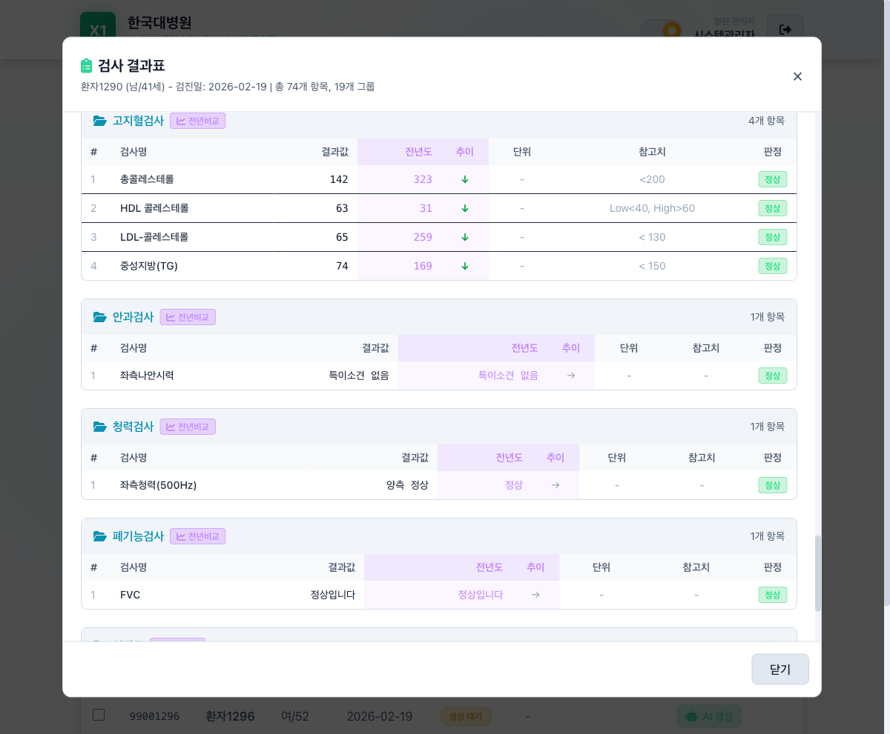
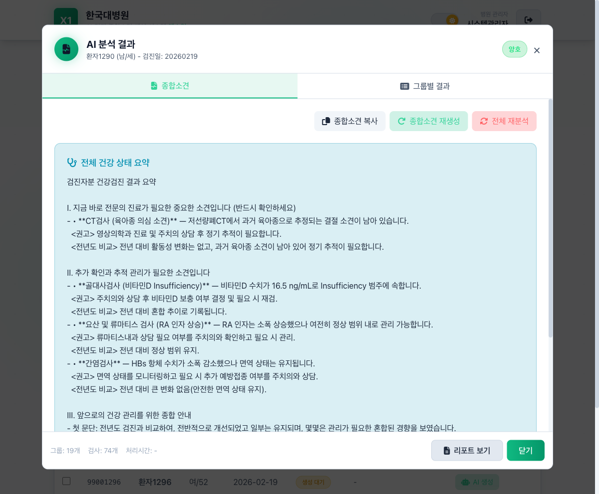
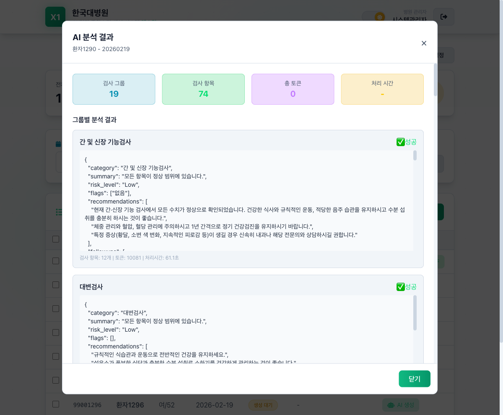
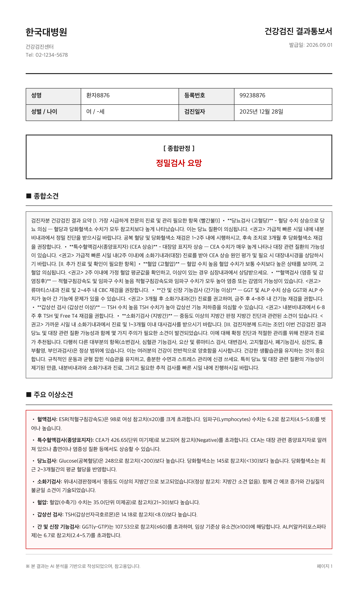

# AI 종합검진 소개

# 종합검진 AI — 서비스 소개

> 건강검진 결과를 **AI가 검진자 눈높이로 설명**해주는 병원용 검진결과 해설·리포트 시스템
> 

---

## 1. 이 서비스는 무엇인가요?

**종합검진 AI**는 병원에서 시행한 건강검진 결과(혈액·소변·영상·기능검사 등)를 불러와, 생성형 AI가 각 검사의 의미를 **검진자가 이해하기 쉬운 한국어 설명**으로 자동 생성하는 서비스입니다.

기존 검진결과지는 수치와 참고치만 나열되어 일반인이 해석하기 어렵습니다. 이 서비스는 검사 항목별로:
- 정상 소견은 안심할 수 있게 설명하고
- 참고치를 벗어난 항목은 **임상적 의미 + 권고 진료과**를 함께 안내하며
- 전체를 아우르는 **종합소견**과 **결과통보서(리포트)**까지 자동으로 만들어냅니다.

**대상 사용자**: 병원 검진센터의 의료진·행정 담당자 (검진자에게 결과를 설명·전달하는 주체)
**멀티테넌시**: 여러 병원이 각자의 계정·데이터로 사용하도록 병원 단위로 분리되어 있습니다.

> ⚠️ AI가 생성한 결과는 **참고용**이며, 최종 판단은 의료진의 확인을 거치도록 설계되어 있습니다.
> 

---

## 2. 전체 사용 흐름

```
로그인(병원코드·계정)
   → 검진일자·환자 선택
   → AI 분석 실행 (검사그룹별 병렬 분석)
   → 그룹별 결과 확인 (위험도·요약·권고)
   → 전년도 비교 확인
   → 종합소견 자동 생성
   → 결과통보서(리포트) 출력
```

---

## 3. 주요 기능

### 3.1 로그인 · 병원별 접근

병원코드 + 아이디 + 비밀번호로 로그인합니다. 로그인 토큰(JWT)에 병원 식별자가 담겨, 해당 병원의 데이터에만 접근합니다.



— 로그인 화면 (병원코드 / 아이디 / 비밀번호)

---

### 3.2 검진일자별 환자 목록

검진일자를 기준으로 그날 검진받은 환자 목록을 조회하고, 분석할 대상을 선택합니다.



— 검진일자별 환자 목록

---

### 3.3 AI 분석 실행 (진행 상태 표시)

선택한 환자의 검사결과를 검사그룹 단위로 나눠 AI가 병렬 분석합니다. 각 그룹의 처리 진행 상황이 실시간으로 표시됩니다.



— AI 분석 진행 상태

---

### 3.4 검사그룹별 분석 결과

혈액·소변·심전도·영상 등 검사그룹별로 분석 결과가 정리됩니다. 각 그룹은 **위험도(정상 / 주의 / 높음)**, 요약, 유의사항, 권고사항으로 구성됩니다.



— 검사그룹별 결과 목록 탭



— 검사그룹 상세 AI 분석 (예: 골대사검사)

---

### 3.5 검사결과 테이블 · 전년도 비교

각 항목의 수치·단위·참고치·판정을 표로 보여주고, 전년도 검진 데이터가 있으면 **작년 대비 변화(개선/악화/유지)**를 함께 제시합니다.



— 검사결과 테이블 (전년도 비교 포함)



— 전년도 비교 상세 (예: 고지혈검사)

---

### 3.6 종합소견 자동 생성

그룹별 분석 결과를 종합하여, 전체를 아우르는 **종합소견**을 자동으로 생성합니다. 가장 시급한 항목부터 우선순위를 매겨 안내합니다.



— 종합소견 자동 생성 결과



— 분석 결과 전체 화면

---

### 3.7 결과통보서(리포트) 출력

검진자에게 전달할 **건강검진 결과통보서**를 생성합니다. 병원 헤더·환자정보·종합판정·종합소견·주요 이상소견이 인쇄에 최적화된 형태로 정리되며, 공식 버전과 캐주얼 버전을 선택할 수 있습니다.



— 건강검진 결과통보서 (공식 버전 대표 페이지)

---

## 4. AI 분석은 어떻게 동작하나요?

1. **입력 구성**: 검사그룹별 결과(JSON)와 카테고리별 임상 힌트, 환자 속성(성별·나이)을 프롬프트로 조합합니다.
    - 개인정보 보호를 위해 **성명·환자번호·생년월일 등 직접 식별자는 AI 전송 전에 제거**됩니다.
2. **분석 요청**: AI 모델이 지정된 JSON 스키마로만 응답하도록 강제합니다.
    
    ```json
    {
      "category": "카테고리명",
      "summary": "참고치를 벗어난 항목만 수치·참고치 포함 설명",
      "risk_level": "Low | Moderate | High",
      "flags": ["유의 항목"],
      "recommendations": ["생활습관/추가검사 권고"],
      "followups": ["진료과 포함 권고"]
    }
    ```
    
3. **위험도 기반 검토 라우팅**: `risk_level`이 High인 경우 의료진 필수 검토 대상으로 표시하고, 모든 결과에 **AI 생성 고지 문구**를 포함합니다.
4. **종합소견 생성**: 그룹별 결과를 다시 취합해 전체 종합소견을 생성합니다.

**AI 제공자**: 기본은 OpenAI GPT API(`gpt-5-mini`)이며, 병원 내부망 환경에서는 KT GPU(MedGemma) 등 온프레미스 모델로 전환할 수 있습니다.

---

## 5. 시스템 구성

| 구성 | 역할 | 스택 |
| --- | --- | --- |
| **demo** | 검진결과 조회·AI 분석·리포트 (검진센터 실무 화면) | React 19 + TypeScript + Vite + Tailwind |
| **admin-hospital** | 검사그룹·임상 힌트·프롬프트 관리 (설정) | React 19 + TypeScript + Zustand + React Query |
| **backend** | 인증·분석 오케스트레이션·AI 연동·API | Spring Boot 3.2 + JPA + JWT + PostgreSQL |
| **DB** | 검진 데이터·분석 결과 저장, 병원 EMR(`emr` 스키마) 연동 | PostgreSQL 15 |
- **멀티테넌시**: 병원(Hospital) ↔︎ 사용자(User) 구조, 요청마다 병원 단위로 데이터 격리
- **EMR 연동**: 병원 EMR의 검사결과를 읽기 전용으로 조회하여 분석 입력으로 사용