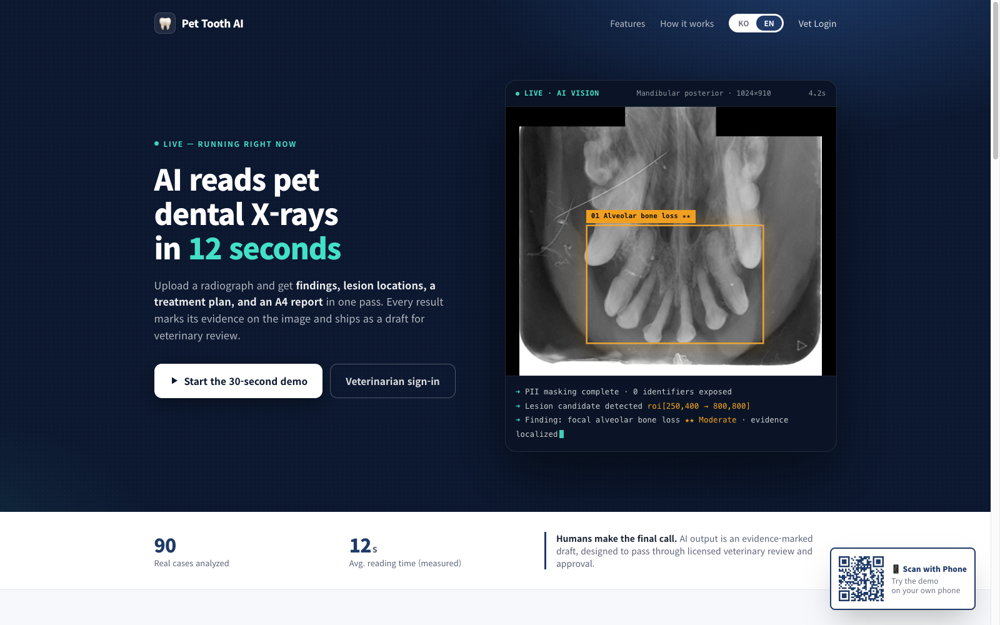
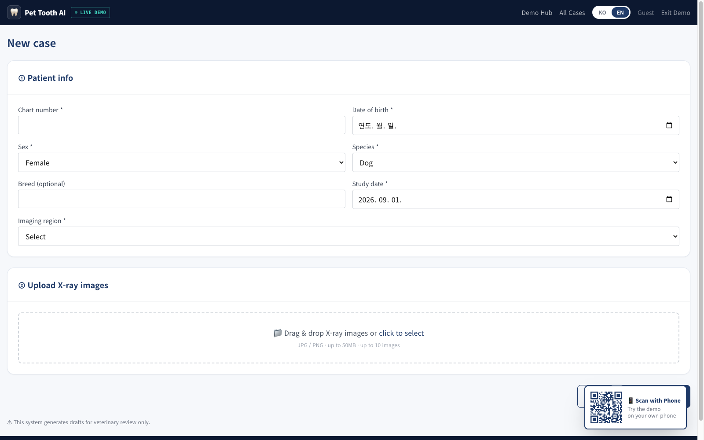
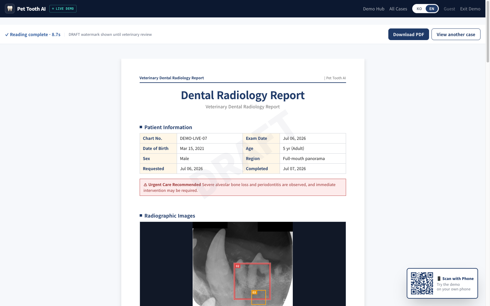
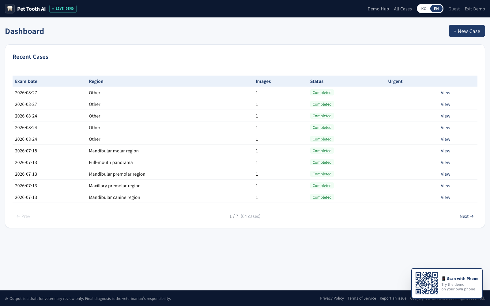
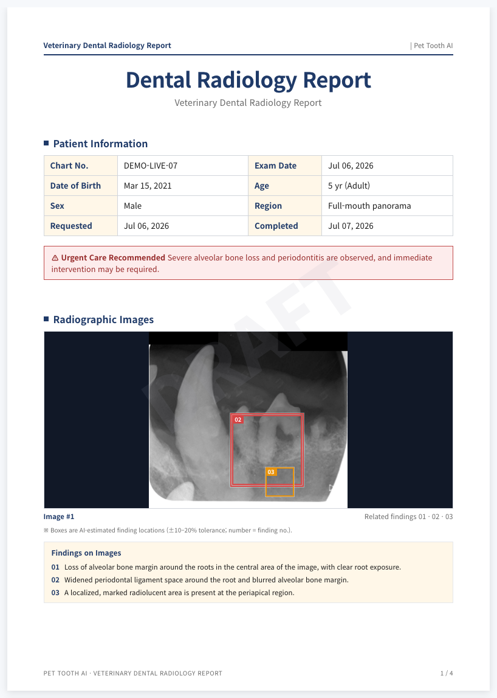
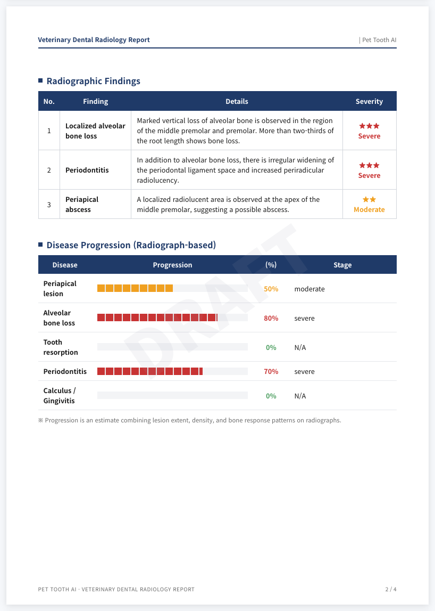
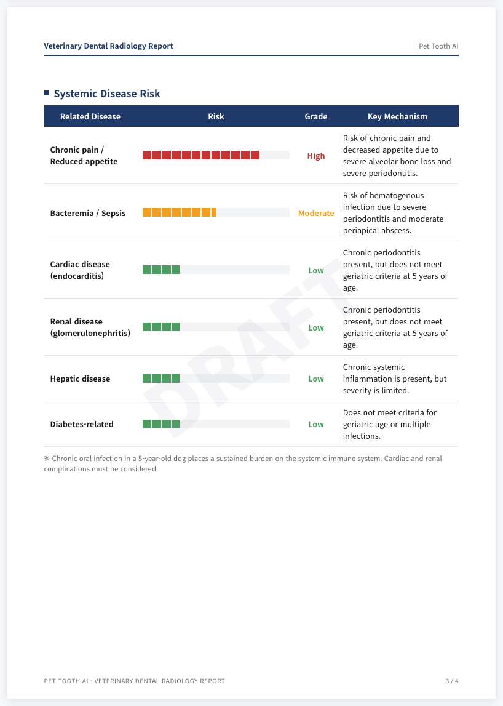
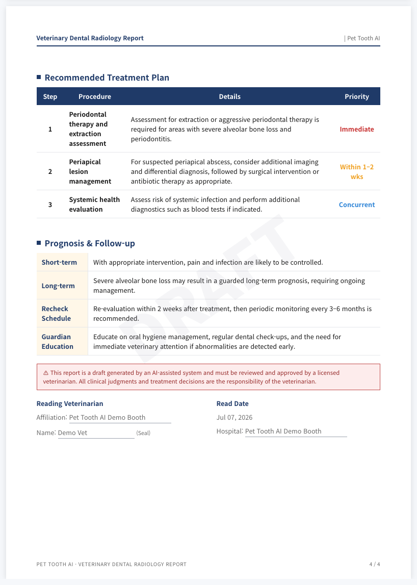
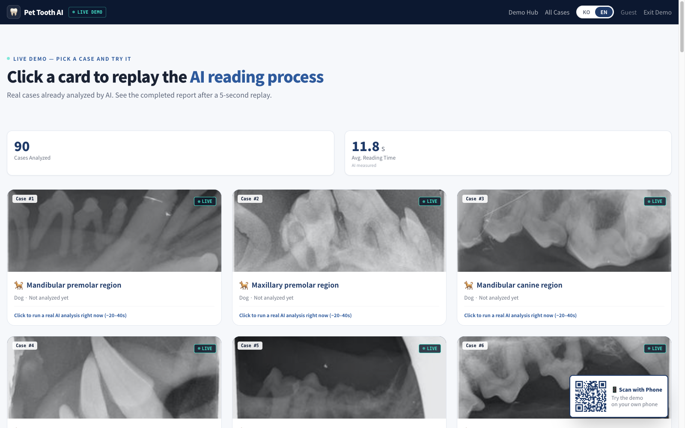

# Pet Tooth AI 서비스 소개

# Pet Tooth AI — 반려동물 치과 X-ray AI 판독 보조 서비스

> **X-ray를 올리면 12초 안에, 소견·병변 위치·처치 계획·A4 보고서까지.**
모든 결과는 근거 부위를 영상 위에 표시하고, 수의사 검토를 거치는 초안(Draft)으로 제공됩니다.
> 
- 서비스 주소: [**https://pettooth.savethelife.io**](https://pettooth.savethelife.io/)
- 운영: DIGIRAY.Corp · 베타 기간 전 기능 무료
- 체험: 설치·회원가입 없이 브라우저에서 30초 데모 (`/demo`)

*메인 화면: 업로드부터 판독 완료까지의 과정을 보여주는 라이브 판독 콘솔*

---

## 1. 어떤 서비스인가요?

Pet Tooth AI는 **동물병원의 치과 방사선(X-ray) 판독을 보조하는 AI 서비스**입니다.

반려동물 치과 질환은 겉으로 드러나지 않아 방사선 판독이 필수지만, 진료 현장에서 촬영 영상을 꼼꼼히 판독하고 보호자 상담용 문서까지 만드는 데는 상당한 시간이 듭니다. Pet Tooth AI는 이 과정을 다음처럼 바꿉니다.

| 기존 | Pet Tooth AI |
| --- | --- |
| 촬영 후 수의사가 육안 판독 | 업로드 즉시 AI가 초안 판독 (평균 12초, 실측) |
| 소견을 구두·수기로 정리 | 표준 용어 기반 구조화 소견 + 병변 위치 표시 |
| 보호자 상담 자료 별도 제작 | 병원 양식 A4 보고서·PDF 자동 생성 (한/영) |
| — | 수의사가 초안을 검토·수정·승인 → 최종 보고서 |

**핵심 원칙 — 사람이 최종 판단합니다.** AI 출력은 근거가 표시된 초안이며, 면허를 가진 수의사의 검토·승인 단계를 거치도록 설계되었습니다. 검토 전 보고서에는 DRAFT 워터마크가 표시됩니다. (의료기기 아님)

---

## 2. 사용 흐름 — 세 단계

### ① 영상 전송

진료실 촬영 소프트웨어에서 자동 전송(연동 API)하거나, 웹에서 X-ray를 업로드합니다. 환자 정보(종·나이·성별·촬영 부위)를 함께 입력하면 AI 판독 정확도에 반영됩니다.

 *새 케이스 등록: 환자 정보 입력 + X-ray 드래그 앤 드롭 업로드*

### ② AI 판독

업로드된 영상은 5단계 파이프라인을 거칩니다: 이미지 전처리 → **환자정보 자동 마스킹(OCR)** → 비전 AI 판독(8단계 임상 프롬프트) → 스키마 검증·신뢰도 게이팅 → A4 PDF 조판. 진행 상황이 실시간으로 표시됩니다.

*AI 판독 진행 화면: 단계별 파이프라인이 실시간으로 표시*

### ③ 수의사 검토·확정

완성된 초안을 수의사가 화면에서 검토하고, 필요한 부분을 수정한 뒤 승인하면 최종 보고서가 됩니다. 수정 이력은 감사 목적으로 보존됩니다.

*케이스 목록: 병원의 전체 검사 이력을 상태별로 관리*

---

## 3. 판독 보고서 — 실제 결과물

병원 양식 그대로의 **낱장 A4 보고서**가 생성됩니다. 매 페이지에 병원 머리말과 페이지 번호가 들어가며, 버튼 하나로 PDF 다운로드가 가능합니다. 아래는 실제 AI가 판독한 케이스(중증·긴급)의 보고서 4페이지입니다.

### 3-1. 환자 정보 · 긴급 알림 · 병변 위치 표시

소견마다 **X-ray 위에 근거 부위를 박스(ROI)로 표시**합니다 — 결과만 주지 않고 근거를 함께 보여주는, 수의사가 검증할 수 있는 AI입니다. 긴급 처치가 필요한 케이스는 보고서 상단에 경고 배너가 표시됩니다.

*보고서 1p: 환자 정보, 긴급 처치 권고 배너, 병변 위치(ROI)가 표시된 X-ray와 이미지 소견*

### 3-2. 구조화 소견 · 질환 진행도

소견은 표준 임상 용어집 기반으로 구조화되고 중증도(★~★★★)가 매겨집니다. 주요 질환 5종(근단 병소·치조골 소실·치근 흡수·치주염·치석/치은염)의 진행도가 바 차트로 정리됩니다.

*보고서 2p: 중증도별 소견 표 + 질환 진행도 차트*

### 3-3. 전신 질환 위험 · 처치 계획 · 예후

구강 질환이 심장·신장 등 전신에 미치는 위험을 6개 항목으로 평가하고, 우선순위가 매겨진 처치 계획과 예후·추적 관찰 일정, 보호자 교육 사항까지 제안합니다. 마지막 페이지에는 면책 고지와 수의사 서명란이 들어갑니다.

*보고서 3p: 전신 질환 위험 평가*

*보고서 4p: 권장 처치 계획, 예후·추적 관찰, 수의사 서명란*

---

## 4. 주요 기능

| 기능 | 설명 |
| --- | --- |
| 🎯 **병변 위치 표시 (Explainable)** | 모든 소견을 X-ray 위 ROI 박스로 지목 — AI 추정 위치임을 명시해 수의사 검증을 전제로 설계 |
| ⚡ **빠른 판독** | 업로드부터 완성 초안까지 평균 12초(실측) — 진료 흐름을 끊지 않는 속도 |
| 🔁 **이중 판독 교차 검증** | 동일 검사를 독립적으로 두 번 판독해 서버가 대조 — 양쪽에서 일치한 소견만 “검증됨”으로 표시하고, 한쪽에만 나타난 소견은 신뢰도를 낮춰 과잉 보고를 억제 |
| 🔒 **환자정보 자동 마스킹** | 영상 속 차트번호·날짜를 OCR로 찾아 가린 뒤에만 AI 분석 — 개인정보가 분석 서버에 노출되지 않음 |
| 📄 **A4 보고서 + PDF** | 병원 양식 낱장 조판, 페이지별 머리말, 원클릭 PDF — 보호자 상담·차트 보관용 |
| 🌐 **한/영 즉시 전환** | 같은 케이스를 국문·영문 보고서로 — 외국인 보호자 상담, 해외 시연에 그대로 사용 |
| 🔌 **촬영 SW 연동 API** | 촬영이 끝나는 순간 영상이 자동 전송되는 push 연동(API 키 인증) — 기존 촬영 워크플로에 그대로 얹힘. 연동 영상 원본은 분석 후 즉시 삭제 |
| ⚠️ **긴급 케이스 알림** | 고신뢰·중증 소견 감지 시 보고서 상단에 긴급 처치 권고 배너 표시 |

---

## 5. 직접 체험해 보세요 — 라이브 데모

설치도 회원가입도 없이, 실제로 AI가 판독한 케이스들을 브라우저에서 바로 재생해 볼 수 있습니다. 양호부터 긴급까지 다양한 중증도의 케이스가 준비되어 있으며, 아직 분석 전인 케이스를 클릭하면 **지금 이 순간 실제 AI 분석**이 실행됩니다.

*데모 허브: 실분석 완료 케이스 갤러리 (누적 90건+, 평균 판독 11.8초 실측 표시)*

👉 [**https://pettooth.savethelife.io/demo**](https://pettooth.savethelife.io/demo)

---

## 6. 신뢰와 책임

- **수의사가 최종 판단합니다.** AI 출력은 검토용 초안이며, 수정·승인 전에는 DRAFT 워터마크가 유지됩니다. 최종 진단과 처치 결정은 면허를 가진 수의사의 책임 하에 이루어집니다.
- **개인정보 보호.** 영상 내 환자 식별 정보는 분석 전 자동 마스킹되며, AI에는 임상 변수(종·나이·성별·부위)만 전달됩니다. 연동 경로로 수신한 원본 영상은 분석 완료 즉시 삭제됩니다.
- **본 시스템은 의료기기가 아닙니다.** 진단 보조 참고 자료를 생성하는 소프트웨어 도구입니다.

---

## 7. 시작하기

| 방법 | 안내 |
| --- | --- |
| **웹 사용** | [https://pettooth.savethelife.io](https://pettooth.savethelife.io/) 회원가입(무료 베타) → 새 케이스 등록 → 바로 판독 |
| **데모 체험** | [https://pettooth.savethelife.io/demo](https://pettooth.savethelife.io/demo) — 가입 없이 30초 |
| **촬영 SW 연동** | 연동 API 문의 (Digiray 장비 사용 병원 대상 push 연동 지원) |